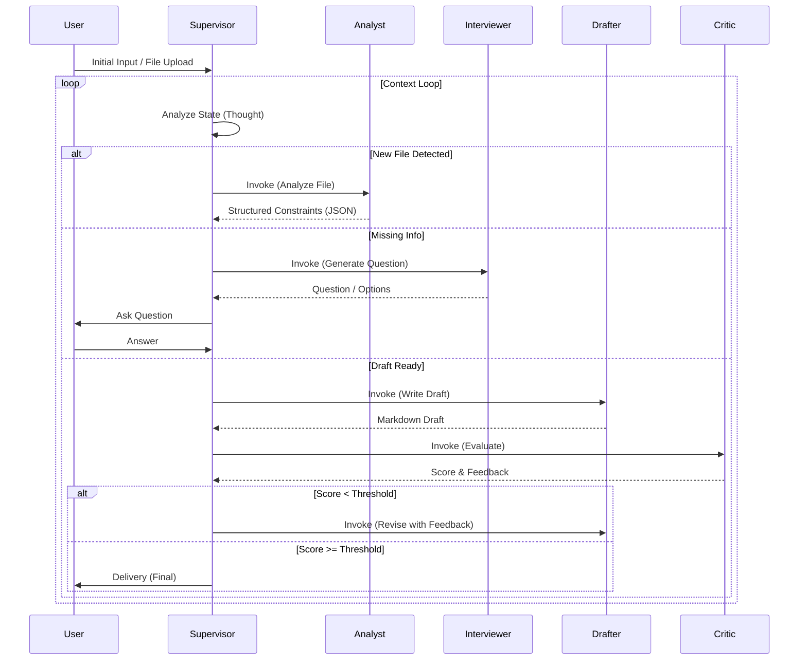

# AI Insight Agency: Multi-Agent System Architecture (v2.0)

**Version:** 2.0 (Refined & Modularized)  
**Date:** 2026-01-11  
**Architect:** AI System Architect

---

## 1. System Architecture Overview

This document defines the **AI Insight Agency** as a robust Multi-Agent System (MAS).  
The system operates on a central **Orchestrator pattern** where a Supervisor manages the lifecycle of a task and delegates specific sub-tasks to specialized Sub-Agents.

### 1.1. Interaction Flow



---

## 2. Agent Definitions

Each agent in the system has been modularized into independent specification files.

### 2.1. 🎩 [Supervisor Agent (The Orchestrator)](file:///e:/developement/ai-assistant/agents/supervisor.md)

**Role:** Project Manager & State Maintainer.  
**Key Responsibility:** Intent Recognition, Routing, and Context Management.

### 2.2. 📂 [Analyst Agent (Requirement Analyst)](file:///e:/developement/ai-assistant/agents/analyst.md)

**Role:** Data Extractor & Constraint Setter.  
**Key Responsibility:** Extracts strict JSON constraints from uploaded files.

### 2.3. 🎤 [Interviewer Agent (Adaptive Interviewer)](file:///e:/developement/ai-assistant/agents/interviewer.md)

**Role:** Information Gatherer.  
**Key Responsibility:** Asks adaptive questions (Direct, A/B, Examples) to fill information gaps.

### 2.4. ✍️ [Drafter Agent (Content Creator)](file:///e:/developement/ai-assistant/agents/drafter.md)

**Role:** Markdown Writer.  
**Key Responsibility:** Drafts the project proposal in Markdown based on collected context.

### 2.5. ⚖️ [Critic Agent (Quality Assurance)](file:///e:/developement/ai-assistant/agents/critic.md)

**Role:** Evaluator.  
**Key Responsibility:** Evaluates the draft against constraints and provides a score/feedback.

---

## 3. Integration & State Management

### 3.1. State Object (Global Context)

The `Supervisor` maintains a JSON object representing the entire session state:

```json
{
  "session_id": "uuid-v4",
  "user": {
    "name": "Max",
    "role": "Planner"
  },
  "project_context": {
    "source_file_content": "...",
    "constraints": { ... }, 
    "user_answers": { ... }
  },
  "workflow_state": {
    "current_step": "INTERVIEW", 
    "draft_version": 1,
    "last_satis_score": 0
  }
}
```

### 3.2. Error Handling

- **Hallucination Check:** If Analyst returns empty constraints for a clear file, Supervisor triggers a retry with a "Recall" prompt.
- **Loop Prevention:** If Critic fails the draft 3 times, Supervisor asks User for manual override or specific guidance.
